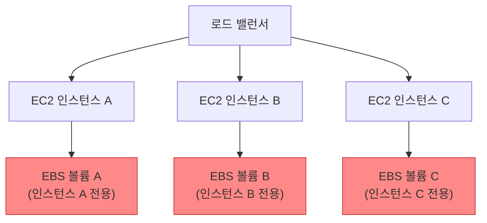

## TL;DR

> Amazon EFS는 여러 EC2 인스턴스가 동시에 읽고 쓸 수 있는 완전 관리형 공유 파일 시스템이다. EBS는 단일 인스턴스 전용 블록 스토리지, S3는 HTTP API 기반 객체 스토리지 — 세 서비스는 각자 다른 문제를 해결한다.

---

## 무엇인가 (What)

Amazon EFS(Elastic File System)는 AWS가 완전 관리형으로 제공하는 **NFS 기반 공유 파일 시스템**이다. 여러 EC2 인스턴스, ECS 태스크, Lambda가 동시에 같은 파일 시스템을 마운트해 읽고 쓸 수 있다.

AWS 스토리지는 크게 세 종류로 나뉜다.

| 서비스                          | 유형          | 프로토콜  | 동시 접속     | 대표 사용 사례                 |
| ------------------------------- | ------------- | --------- | ------------- | ------------------------------ |
| **EBS** (Elastic Block Store)   | 블록 스토리지 | iSCSI     | 단일 인스턴스 | OS 루트 볼륨, 데이터베이스     |
| **EFS** (Elastic File System)   | 파일 시스템   | NFSv4     | 수천 개 동시  | 공유 콘텐츠, CI/CD, CMS        |
| **S3** (Simple Storage Service) | 객체 스토리지 | HTTP REST | 무제한        | 정적 파일, 백업, 데이터 레이크 |

### 핵심 개념 요약

| 개념                 | 설명                                                                 |
| -------------------- | -------------------------------------------------------------------- |
| **Elastic**          | 용량을 미리 지정하지 않아도 자동으로 늘고 줄어든다                   |
| **Multi-AZ**         | 기본적으로 리전 내 여러 가용 영역에 걸쳐 자동 복제된다               |
| **NFSv4**            | 표준 NFS 프로토콜 — Linux/Unix 환경에서 기존 명령어 그대로 사용 가능 |
| **Mount Target**     | VPC 서브넷당 하나씩 생성하는 NFS 엔드포인트                          |
| **Performance Mode** | General Purpose(기본) vs Max I/O(고도 병렬 처리)                     |
| **Throughput Mode**  | Bursting(기본) vs Provisioned vs Elastic                             |
| **Storage Class**    | Standard(다중 AZ) vs One Zone(단일 AZ, 약 47% 저렴)                  |

---

## 왜 필요한가 (Why)

### EBS의 한계 — 단일 인스턴스 구조

EBS는 하나의 EC2 인스턴스에 붙는 블록 디스크다. 애플리케이션 서버가 스케일 아웃되면, 각 인스턴스는 서로 다른 EBS를 갖게 되어 파일을 공유할 수 없다.

아래는 EBS를 쓸 때 발생하는 공유 파일 문제 상황이다.



사용자가 인스턴스 A에 파일을 업로드하면 B·C에서는 그 파일이 보이지 않는다. 별도 동기화 메커니즘이 없으면 인스턴스마다 파일 상태가 달라진다.

EFS는 이 문제를 근본적으로 해결한다. 모든 인스턴스가 하나의 파일 시스템을 공유하므로 어느 인스턴스에서 써도 전체가 같은 파일을 바라본다.

### S3와의 차이

S3는 REST API(HTTP)로 접근하는 객체 스토리지다. `open()`, `write()`, `read()` 같은 POSIX 시스템 콜을 직접 쓸 수 없다. 기존 애플리케이션을 코드 수정 없이 공유 스토리지에 연결하려면 EFS가 맞다.

---

## 어떻게 동작하는가 (How)

EFS는 VPC 내 각 서브넷에 **Mount Target**을 생성해 NFS 엔드포인트를 제공한다. EC2 인스턴스는 이 엔드포인트에 NFS 마운트해 파일 시스템에 접근한다.

아래는 여러 AZ에 걸친 EFS 접근 구조다.


### 마운트 방법

Linux EC2에서 EFS를 마운트하는 두 가지 방법이다.

```bash
# 방법 1: NFS 직접 마운트
sudo mount -t nfs4 \
  -o nfsvers=4.1,rsize=1048576,wsize=1048576,hard,timeo=600,retrans=2 \
  fs-0123456789abcdef.efs.ap-northeast-2.amazonaws.com:/ \
  /mnt/efs

# 방법 2: EFS 마운트 헬퍼 사용 (권장 — TLS 암호화 + IAM 인증 지원)
sudo mount -t efs -o tls fs-0123456789abcdef:/ /mnt/efs
```

`amazon-efs-utils`의 마운트 헬퍼를 사용하면 전송 중 암호화(TLS)와 IAM 기반 접근 제어를 추가 설정 없이 적용할 수 있다.

---

## 선택 가이드

### EFS vs EBS vs S3

| 기준               | EFS                | EBS                     | S3              |
| ------------------ | ------------------ | ----------------------- | --------------- |
| **접근 방식**      | NFS 파일 시스템    | 블록 디바이스           | REST API        |
| **동시 접속**      | 수천 개 인스턴스   | 1개 (Multi-Attach 예외) | 무제한          |
| **가용 영역**      | 다중 AZ (기본)     | 단일 AZ                 | 리전 전체       |
| **최소 용량**      | 없음 (자동 조정)   | 1 GiB                   | 없음            |
| **OS 지원**        | Linux/Unix         | Linux, Windows          | 무관            |
| **비용 (GB/월)**   | ~$0.30             | ~$0.08 (gp3)            | ~$0.023         |
| **대표 사용 사례** | 공유 파일, CMS, CI | DB 볼륨, 루트 디스크    | 백업, 정적 파일 |

### EFS Standard vs One Zone

| 클래스       | 특징                                      | 추천 상황                         |
| ------------ | ----------------------------------------- | --------------------------------- |
| **Standard** | 다중 AZ 복제, 높은 내구성 (99.999999999%) | 프로덕션 공유 파일 시스템         |
| **One Zone** | 단일 AZ, 약 47% 저렴                      | 개발·테스트, 재생성 가능한 데이터 |

### SAA-C03 출제 포인트

1. **"여러 EC2가 동시에 파일을 공유"** → EFS (EBS는 오답)
2. **"Linux 파일 시스템처럼 마운트"** → EFS (S3는 오답)
3. **"Windows EC2 공유 파일 시스템"** → FSx for Windows File Server (EFS는 Linux 전용)
4. **"비용 최적화"** → EFS Intelligent-Tiering 또는 One Zone 클래스 검토
5. **"EBS Multi-Attach"** → io1/io2 한정, 같은 AZ 내 최대 16개까지 — EFS의 다중 AZ 공유와 다름

---

## 비용 최적화

### EFS 스토리지 클래스 계층

EFS는 네 가지 스토리지 클래스를 제공한다. 접근 빈도와 가용성 요구사항에 따라 선택한다.

| 스토리지 클래스 | 가용 영역 | 용량 단가 (GB/월) | 접근 단가 (GB) | 적합한 데이터                    |
| --------------- | --------- | ----------------- | -------------- | -------------------------------- |
| **Standard**    | 다중 AZ   | $0.30             | 없음           | 자주 접근하는 프로덕션 파일      |
| **Standard-IA** | 다중 AZ   | $0.025            | $0.01          | 가끔 읽는 파일 (로그, 아카이브)  |
| **One Zone**    | 단일 AZ   | $0.16             | 없음           | 자주 접근하지만 가용성 요건 낮음 |
| **One Zone-IA** | 단일 AZ   | $0.013            | $0.01          | 재생성 가능하고 드물게 접근      |

Standard → Standard-IA 전환만으로 용량 비용을 **약 92% 절감**할 수 있다. 단, 접근할 때마다 GB당 요금이 추가되므로 접근 빈도가 높으면 역효과가 날 수 있다.

### Intelligent Tiering — 수명 주기 정책 자동화

접근 패턴을 직접 분석하기 어렵다면 EFS Intelligent Tiering을 사용한다. 수명 주기 정책을 설정하면 지정한 기간 동안 접근이 없는 파일을 IA 클래스로 자동 이동하고, 다시 접근하면 Standard로 복귀한다.

```bash
# AWS CLI로 수명 주기 정책 설정 (30일 미접근 시 IA로 이동)
aws efs put-lifecycle-configuration \
  --file-system-id fs-0123456789abcdef \
  --lifecycle-policies \
    TransitionToIA=AFTER_30_DAYS,TransitionToPrimaryStorageClass=AFTER_1_ACCESS
```

수명 주기 정책 옵션: `AFTER_7_DAYS`, `AFTER_14_DAYS`, `AFTER_30_DAYS`, `AFTER_60_DAYS`, `AFTER_90_DAYS`

`TransitionToPrimaryStorageClass=AFTER_1_ACCESS`를 함께 설정하면 IA에 있는 파일이 한 번 접근될 때 자동으로 Standard로 복귀한다 — 자주 다시 찾는 파일이 IA에 계속 쌓이는 것을 방지한다.

### Throughput Mode 선택

처리량 모드는 비용에 직접적인 영향을 미친다.

| 모드            | 과금 방식                 | 적합한 상황                                          |
| --------------- | ------------------------- | ---------------------------------------------------- |
| **Bursting**    | 스토리지 크기 비례 (기본) | 스토리지가 클수록 버스트 풀이 커짐, 소규모 워크로드  |
| **Provisioned** | 지정한 처리량 고정 과금   | 스토리지는 작지만 높은 처리량이 일정하게 필요한 경우 |
| **Elastic**     | 실제 사용량 기준          | 예측 불가능한 트래픽, 비용 예측이 어렵지만 낭비 없음 |

Bursting 모드는 저장된 데이터 1 TiB당 50 MiB/s 기준 처리량과 버스트 크레딧 풀을 제공한다. 스토리지가 1 TiB 미만인데 지속적으로 높은 처리량이 필요하다면 Provisioned 또는 Elastic이 유리하다.

### 비용 절감 체크리스트

- [ ] 30일 이상 미접근 파일이 있으면 수명 주기 정책으로 IA 전환 설정
- [ ] 개발·스테이징 환경은 One Zone 클래스 사용 (47% 절감)
- [ ] 스토리지 사용량 대비 처리량 요건 확인 — Bursting이 충분하면 Provisioned 불필요
- [ ] EFS Access Point별로 태그를 달아 Cost Explorer에서 워크로드별 비용 추적
- [ ] CloudWatch `StorageBytes` 메트릭으로 Standard vs IA 비율을 주기적으로 모니터링

---

## 참고 자료

- [Amazon EFS란 무엇인가 — AWS 공식 문서](https://docs.aws.amazon.com/efs/latest/ug/whatisefs.html)
- [Amazon EBS란 무엇인가 — AWS 공식 문서](https://docs.aws.amazon.com/ebs/latest/userguide/what-is-ebs.html)
- [Amazon S3이란 무엇인가 — AWS 공식 문서](https://docs.aws.amazon.com/AmazonS3/latest/userguide/Welcome.html)
- [EFS 성능 모드 — AWS 공식 문서](https://docs.aws.amazon.com/efs/latest/ug/performance.html)
- [EFS 스토리지 클래스 — AWS 공식 문서](https://docs.aws.amazon.com/efs/latest/ug/storage-classes.html)
- [AWS 스토리지 서비스 비교 — AWS 공식](https://aws.amazon.com/products/storage/)
