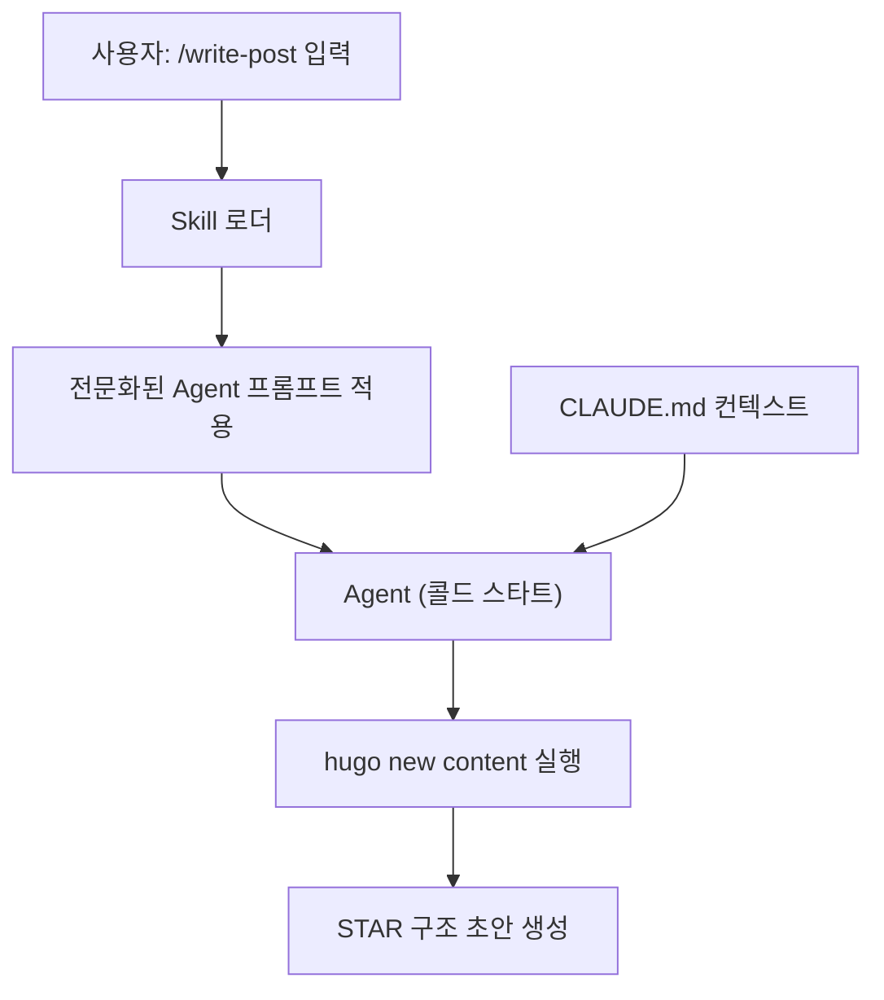

## TL;DR

> - **Agent**는 특정 역할에 전문화된 독립 AI 인스턴스, **Skill**은 그 Agent를 초기화해 실행하는 슬래시 커맨드다.
> - Agent는 콜드 스타트라 CLAUDE.md에 프로젝트 컨텍스트를 잘 정의해두는 것이 품질의 핵심이다.
> - 주제·환경·문제만 던지면 `/write-post`가 STAR 구조 초안을 자동으로 만들어 준다.

---

## 무엇인가 (What)

Claude Code의 글쓰기 자동화는 **Agent**와 **Skill** 두 개념 위에 서 있다.

### 핵심 개념 요약

| 개념  | 정의                                  | 비유                      |
| ----- | ------------------------------------- | ------------------------- |
| Agent | 특정 역할에 전문화된 독립 AI 인스턴스 | 특정 분야 전문가          |
| Skill | Agent를 초기화·실행하는 슬래시 커맨드 | 전문가를 부르는 호출 버튼 |

### Agent — 역할에 특화된 독립 인스턴스

Agent는 메인 Claude(일반 대화)와 달리 **콜드 스타트**로 동작한다. 현재 대화 맥락을 모른 채 시작하므로 별도 브리핑이 필요하다.

| 구분          | 메인 Claude         | Agent                              |
| ------------- | ------------------- | ---------------------------------- |
| 컨텍스트      | 현재 대화 전체를 앎 | **콜드 스타트** — 별도 브리핑 필요 |
| 역할          | 범용                | 특정 역할에 전문화                 |
| 실행 방식     | 현재 세션           | 독립 서브프로세스로 병렬 실행 가능 |
| 컨텍스트 보호 | —                   | 메인 컨텍스트 창을 오염시키지 않음 |

내장 Agent 타입 예시 — `technical-writer`(기술 문서), `backend-architect`(백엔드 설계), `security-engineer`(보안 검토), `Explore`(읽기 전용 코드 탐색) 등 역할별로 나뉜다.

### Skill — Agent를 부르는 슬래시 커맨드

Skill은 Agent를 **어떻게 초기화할지** 정의하는 래퍼(wrapper)다. `/write-post`, `/sc:document` 같은 커맨드를 입력하면 해당 역할에 맞는 전문화 프롬프트와 함께 작업이 시작된다.

```markdown
---
name: write-post
description: "Hugo 블로그 STAR 구조 초안 자동 생성"
---

# /write-post — Hugo 블로그 포스트 자동 생성

## 동작 순서

1. `hugo new content posts/<슬러그>.md` 실행
2. STAR 구조로 내용 작성
3. front matter tags·categories 채우기
```

`name`·`description`은 Claude가 Skill을 인식하는 데 쓰이고, 본문은 Agent가 실제로 따르는 지시사항이다.

---

## 왜 필요한가 (Why)

기술 블로그를 운영하다 보면 글을 쓰는 행위 자체보다 **구조를 잡는 데 시간이 더 걸린다**.

- 경험은 머릿속에 있는데, STAR 형식으로 정리하려면 별도 작업이 필요하다.
- 반복 섹션(TL;DR, 배경, 결과 테이블)마다 같은 고민을 반복한다.
- 결국 "나중에 써야지"가 쌓여 블로그가 방치된다.

아래는 직접 작성할 때 시간이 어디서 새는지를 보여준다.


Agent와 Skill은 **구조 잡기와 반복 섹션 작성을 위임**해 이 병목을 끊는다. 작성자는 실제 경험과 수치 입력에만 집중하면 된다.

---

## 어떻게 동작하는가 (How)

Skill을 입력하면 로더가 전문화된 Agent 프롬프트를 적용하고, Agent가 CLAUDE.md 컨텍스트를 읽어 작업을 수행한다.



### Step 1. CLAUDE.md에 컨텍스트 명시

Agent가 콜드 스타트이므로, 매번 브리핑하는 대신 프로젝트 규칙을 CLAUDE.md에 적어둔다.

```markdown
## Writing Convention

- 새 글: `hugo new content posts/<slug>.md` (archetypes 자동 적용)
- 구조: TL;DR → 배경 → 삽질 과정 → 해결 → 결과 → 회고
- 실제 경험 기반 작성 (교과서식 설명 금지)
- 결과 섹션에 Before/After 수치 테이블 포함
```

### Step 2. Skill로 글쓰기 위임

```text
/write-post
주제: Kubernetes Pod OOM 트러블슈팅
슬러그: k8s-pod-oom-troubleshooting
환경: RKE2 v1.29, 워커 노드 8GB RAM
문제: 특정 시간대 Pod OOMKilled 반복 (limits 미설정 컨테이너 메모리 누수)
해결: VPA 도입 + limits 정책 강제화
```

`/write-post`는 내부적으로 `hugo new content`를 실행하고 `archetypes/default.md`의 STAR 구조를 자동 적용한다.

### Step 3. 로컬 확인 후 보완·배포

`hugo server -D`로 렌더링을 확인하고, 실제 에러 메시지·Before/After 수치를 채운 뒤 `git push`하면 GitHub Actions가 자동 배포한다.

---

## 선택 가이드

### 어떤 Skill을 쓸까

| 작업            | 권장 Skill          | 이유                             |
| --------------- | ------------------- | -------------------------------- |
| 블로그 STAR 글  | `/write-post`       | Hugo archetypes·STAR 구조 내장   |
| 개념 소개 글    | `tech-concept-post` | What/Why/How + Mermaid 구조      |
| 장문·voice 중심 | `/article-writing`  | 브랜드 voice 일관성              |
| 코드 구현       | `/sc:implement`     | 기능 구현 전용 — 글쓰기엔 부적합 |

### Skill 파일은 어디에 둘까

| 위치                  | 적용 범위            | 용도                  |
| --------------------- | -------------------- | --------------------- |
| `~/.claude/commands/` | 전역 — 모든 프로젝트 | 범용 워크플로우 Skill |
| `.claude/commands/`   | 해당 프로젝트만      | 프로젝트 특화 Skill   |

같은 이름이면 **프로젝트 Skill이 우선**되므로, 전역 Skill을 프로젝트에서 재정의할 수 있다.

---

## 참고 자료

- [Claude Code 공식 문서 — Subagents](https://docs.anthropic.com/en/docs/claude-code/sub-agents)
- [Claude Code 공식 문서 — Slash Commands](https://docs.anthropic.com/en/docs/claude-code/slash-commands)
- [Claude Code 공식 문서 — Settings](https://docs.anthropic.com/en/docs/claude-code/settings)
- [Claude Code 공식 문서 — CLAUDE.md memory](https://docs.anthropic.com/en/docs/claude-code/memory)
- [Hugo Content Management](https://gohugo.io/content-management/)
- [Hugo Archetypes](https://gohugo.io/content-management/archetypes/)
