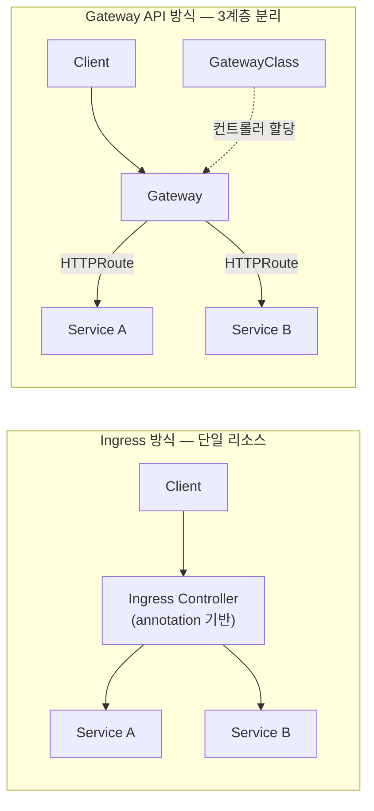
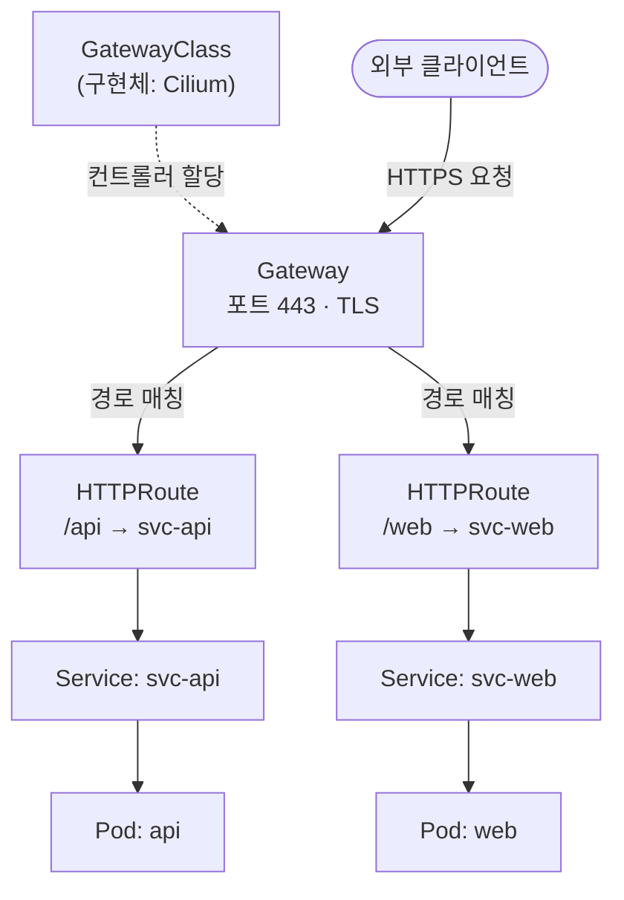

## TL;DR

> Kubernetes Gateway API는 Ingress의 구조적 한계를 해결하는 공식 차세대 트래픽 라우팅 표준이다.
> GatewayClass → Gateway → HTTPRoute 3계층으로 역할을 분리해 annotation 지옥에서 벗어난다.
> Ingress-NGINX Controller가 2026년 3월 EOL을 맞으며, 신규 프로젝트는 Gateway API로 시작하는 게 맞다.

---

## 무엇인가 (What)

Gateway API는 Kubernetes SIG-Network가 설계한 **Ingress를 대체하는 공식 L4/L7 트래픽 라우팅 표준**이다. v1.0 GA(2023.10)를 거쳐 현재 v1.5(2026.02)까지 출시되었으며, GRPCRoute·TCPRoute까지 Stable 상태다.

| 항목                | Ingress                       | Gateway API                            |
| ------------------- | ----------------------------- | -------------------------------------- |
| 지원 프로토콜       | HTTP/HTTPS만                  | HTTP, HTTPS, TCP, UDP, gRPC            |
| 고급 기능           | annotation 의존 (벤더별 상이) | 스펙에 내장 (이식 가능)                |
| 역할 분리           | 없음 (단일 리소스)            | 3계층 (GatewayClass / Gateway / Route) |
| 크로스 네임스페이스 | 불가                          | ReferenceGrant로 명시적 허용           |
| GA 상태             | 오래됨, NGINX EOL 2026.03     | v1.0 이후 안정                         |

### 핵심 리소스

| 리소스             | 관리 주체       | 역할                                            |
| ------------------ | --------------- | ----------------------------------------------- |
| **GatewayClass**   | 인프라 공급자   | 구현체 정의 (Cilium, Istio, Kong 등)            |
| **Gateway**        | 클러스터 운영자 | 로드밸런서 인스턴스, 포트·TLS·네임스페이스 설정 |
| **HTTPRoute**      | 앱 개발자       | 경로·헤더·가중치 기반 라우팅 규칙               |
| **GRPCRoute**      | 앱 개발자       | gRPC 전용 라우팅 (v1.5 Stable)                  |
| **ReferenceGrant** | 클러스터 운영자 | 크로스 네임스페이스 접근 허용                   |

---

## 왜 필요한가 (Why)

Ingress는 2015년 설계되었다. 단순한 HTTP 라우팅에는 충분했지만 클러스터가 복잡해지면서 세 가지 한계가 뚜렷해졌다.

**① 프로토콜 제한** — HTTP/HTTPS 외 TCP·UDP·gRPC는 annotation으로 우회해야 했다.

**② Annotation 지옥** — 트래픽 분할, 헤더 조작, 인증 같은 기능이 컨트롤러마다 다른 annotation으로 구현되어 벤더 종속이 생겼다. nginx.ingress.kubernetes.io/xxx를 쓰다가 Traefik으로 바꾸면 전량 재작성이다.

**③ 역할 분리 불가** — 인프라팀과 앱팀이 같은 Ingress 리소스를 공유하며 권한 충돌이 발생했다.

아래는 Ingress 방식과 Gateway API 방식의 구조 차이다.



Gateway API는 역할을 세 계층으로 명확히 나눈다. 인프라 공급자는 GatewayClass만, 클러스터 운영자는 Gateway를, 앱 개발자는 HTTPRoute를 각자 소유한다. 서로의 리소스를 건드리지 않아도 된다.

---

## 어떻게 동작하는가 (How)

아래는 실제 트래픽이 흐르는 경로다. 클라이언트 요청이 GatewayClass → Gateway → HTTPRoute를 거쳐 최종 Pod에 도달한다.



### GatewayClass

```yaml
apiVersion: gateway.networking.k8s.io/v1
kind: GatewayClass
metadata:
  name: cilium
spec:
  controllerName: io.cilium/gateway-controller
```

### Gateway

```yaml
apiVersion: gateway.networking.k8s.io/v1
kind: Gateway
metadata:
  name: my-gateway
  namespace: infra
spec:
  gatewayClassName: cilium
  listeners:
    - name: https
      port: 443
      protocol: HTTPS
      tls:
        certificateRefs:
          - name: my-cert
```

### HTTPRoute

```yaml
apiVersion: gateway.networking.k8s.io/v1
kind: HTTPRoute
metadata:
  name: api-route
  namespace: app
spec:
  parentRefs:
    - name: my-gateway
      namespace: infra
  rules:
    - matches:
        - path:
            type: PathPrefix
            value: /api
      backendRefs:
        - name: svc-api
          port: 8080
```

HTTPRoute의 `parentRefs`가 Gateway를 참조하고, Gateway의 `allowedRoutes`가 해당 네임스페이스를 허용해야 바인딩된다. 이 **양방향 선택(bidirectional binding)** 덕분에 네임스페이스 간 트래픽 정책이 명시적으로 관리된다.

---

## 구현체 선택 가이드

| 구현체                   | 강점                                     | 추천 상황                           |
| ------------------------ | ---------------------------------------- | ----------------------------------- |
| **Cilium**               | eBPF 기반, L4 처리량 최고, 사이드카 없음 | 고성능 L4/L7, 보안 정책 통합        |
| **Istio (Ambient)**      | 서비스 메시 내장, 사이드카 제거          | 서비스 메시가 이미 있거나 필요할 때 |
| **Envoy Gateway**        | xDS 네이티브, CNCF 표준                  | Envoy 기반 표준 환경                |
| **NGINX Gateway Fabric** | 기존 NGINX 연속성                        | Ingress-NGINX 마이그레이션 경로     |
| **Kong**                 | API 관리 플러그인 생태계                 | Rate Limit·인증 등 API 기능 필요 시 |
| **Traefik**              | 경량, 자동 TLS                           | 소규모 클러스터, 빠른 시작          |

---

## 참고 자료

- [Kubernetes 공식 문서 — Gateway API](https://kubernetes.io/docs/concepts/services-networking/gateway/)
- [Gateway API 공식 사이트](https://gateway-api.sigs.k8s.io/)
- [CNCF — Understanding Kubernetes Gateway API](https://www.cncf.io/blog/2025/05/02/understanding-kubernetes-gateway-api-a-modern-approach-to-traffic-management/)
- [Kong — Gateway API vs Ingress](https://konghq.com/blog/engineering/gateway-api-vs-ingress)
- [Tigera — Ingress vs Gateway API 마이그레이션 가이드](https://www.tigera.io/blog/is-it-time-to-migrate-a-practical-look-at-kubernetes-ingress-vs-gateway-api/)
- [Kubernetes Blog — Gateway API v1.5](https://kubernetes.io/blog/2026/04/21/gateway-api-v1-5/)
- [DEV Community — Gateway API 구현체 비교 2026](https://dev.to/mechcloud_academy/kubernetes-gateway-api-in-2026-the-definitive-guide-to-envoy-gateway-istio-cilium-and-kong-2bkl)
