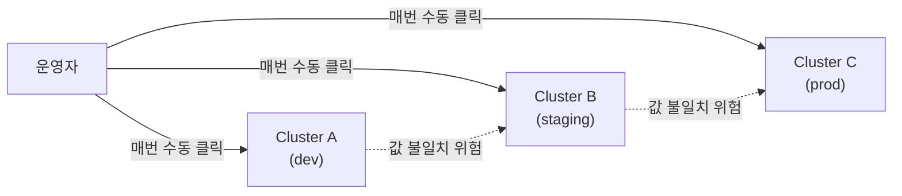
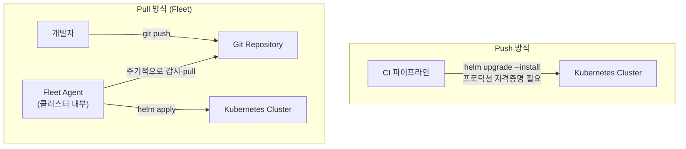

## TL;DR

> Rancher는 Helm을 세 겹으로 감싼다 — UI의 **Apps & Marketplace**, GitOps 엔진 **Fleet**, 그리고 API로 발급한 kubeconfig를 쓰는 **CI/CD 파이프라인**. 프로덕션·멀티클러스터 배포라면 자격증명을 클러스터 밖으로 내보내지 않는 Fleet(pull) 방식이 기본값이 되어야 한다.

---

## 무엇인가 (What)

Rancher는 Helm 위에 새로운 패키징 포맷을 만드는 대신, Helm 명령을 **누가·어떻게 실행할지**를 감싸는 세 가지 층을 제공한다.

| 층위               | 실행 주체                                                 | 배포 방식                   | 대표 화면/리소스                |
| ------------------ | --------------------------------------------------------- | --------------------------- | ------------------------------- |
| Apps & Marketplace | Rancher 서버가 백그라운드에서 `helm install/upgrade` 실행 | UI 클릭 1회성 배포          | Repository / Chart / App        |
| Fleet              | 다운스트림 클러스터 에이전트가 Git을 주기적으로 pull      | GitOps, 멀티클러스터 동기화 | GitRepo / Bundle / `fleet.yaml` |
| CI/CD 파이프라인   | 파이프라인 러너가 직접 `helm upgrade --install` 실행      | Push, 임의 커스텀 로직      | Rancher API로 발급한 kubeconfig |

Apps & Marketplace는 Answers(폼 입력값)를 `--set key=value`로, valuesYaml을 `-f` 옵션으로 변환해 Helm에 그대로 넘긴다. 즉 UI 뒤에서 벌어지는 일은 우리가 평소 터미널에서 치는 `helm install`과 동일하다 — 다만 값 우선순위가 `answers.yaml > --set > values.yaml` 순으로 정해져 있고, UI에서는 answers.yaml과 valuesYaml을 동시에 쓸 수 없다는 제약이 있다.

---

## 왜 필요한가 (Why)

### UI 클릭 배포만으로는 한계가 있다

클러스터가 1개, 환경이 1개뿐이라면 UI에서 차트를 설치하는 것으로 충분하다. 하지만 실제 조직에서는 보통 이런 문제가 겹친다.

- **환경이 여러 개다**: dev / staging / prod마다 replica 수, 리소스 제한, 이미지 태그가 다르다. UI에서 매번 값을 바꿔 클릭하면 실수가 나기 쉽다.
- **클러스터가 여러 개다**: 같은 애플리케이션을 리전별·고객별로 여러 다운스트림 클러스터에 배포해야 한다. 클러스터마다 UI에 들어가 반복 작업하는 것은 확장되지 않는다.
- **배포 이력이 코드로 남지 않는다**: UI 클릭은 "누가 언제 어떤 값으로 배포했는지"를 Git 커밋 히스토리처럼 추적하기 어렵다. 감사(audit)가 필요한 환경에서는 이 자체가 리스크다.

아래는 UI 클릭 배포를 여러 클러스터에 그대로 확장했을 때 생기는 문제 상황이다.



이 문제를 풀기 위해 Rancher는 **Fleet**(Git을 단일 진실 공급원으로 삼는 GitOps 엔진)과, 파이프라인에서 직접 제어할 수 있는 **API 기반 kubeconfig 발급** 경로를 함께 제공한다.

---

## 어떻게 동작하는가 (How)

### 1. Fleet: Git을 클러스터가 직접 당겨간다

Fleet의 핵심 리소스는 두 가지다. **GitRepo**는 어떤 Git 저장소·브랜치·경로를 볼지 정의하고, 그 경로가 스캔되어 **Bundle**(실제 배포 단위)이 된다. 저장소 루트의 `fleet.yaml`에 Helm 차트 정보와 클러스터별 커스터마이징을 적어두면, 각 다운스트림 클러스터의 Fleet 에이전트가 주기적으로 Git을 확인해 스스로 동기화한다 — 즉 중앙에서 명령을 "밀어넣는" 게 아니라 클러스터가 "당겨가는" 구조다.

```yaml
# fleet.yaml — 클러스터 레이블에 따라 다른 values 적용
helm:
  chart: my-app
  repo: https://charts.example.com
  releaseName: my-app
  values:
    replicaCount: 1

targetCustomizations:
  - name: production
    clusterSelector:
      matchLabels:
        env: prod
    helm:
      values:
        replicaCount: 3
        image:
          tag: "1.4.2"
```

### 2. CI/CD 파이프라인에서 직접 배포하기 (push)

Fleet 없이 GitHub Actions/GitLab CI에서 곧바로 배포하고 싶다면, Rancher API로 kubeconfig를 발급받아 쓰면 된다.

```bash
# Rancher API 토큰으로 kubeconfig 발급
curl -s -X POST \
  -H "Authorization: Bearer ${RANCHER_TOKEN}" \
  "https://${RANCHER_URL}/v3/clusters/${CLUSTER_ID}?action=generateKubeconfig" \
  | jq -r '.config' > kubeconfig.yaml

export KUBECONFIG=kubeconfig.yaml

helm upgrade --install my-app ./charts/my-app \
  -f values-base.yaml \
  -f values-prod.yaml \
  --atomic --wait --timeout 5m
```

발급된 kubeconfig 값은 응답의 `status.value`(또는 `config` 필드)에 **한 번만** 노출되므로 파이프라인 변수로 즉시 저장해야 한다. 토큰은 기본 30일 TTL을 가지며, 클러스터 단위로 스코프를 제한해 발급할 수 있다.

### push와 pull, 언제 뭘 쓸까

아래는 같은 배포 목표를 push(파이프라인 직접 실행)와 pull(Fleet이 Git을 감시)로 처리할 때의 흐름 차이다.



Push는 배포가 즉시 일어나고 실행 순서가 명확하지만, 파이프라인이 프로덕션까지 닿는 높은 권한의 자격증명을 항상 들고 있어야 한다. Pull은 자격증명이 클러스터 경계 안에 머물기 때문에 보안·감사 측면에서 유리하고, 클러스터가 늘어나도 동일한 패턴을 재사용할 수 있다. 그래서 실무에서는 **개발 환경은 push로 빠르게, 프로덕션·멀티클러스터는 Fleet 같은 pull 방식으로** 나눠 가져가는 경우가 많다.

### 3. 시크릿과 롤백

values 파일에 평문 시크릿을 넣지 않는 것이 원칙이다. 대표적으로 세 가지 방식이 쓰인다.

- **SOPS + helm-secrets**: 커밋 전 파일을 암호화. 이식성은 좋지만 파이프라인에 복호화 키를 배포해야 한다.
- **Sealed Secrets**: 클러스터별 키로 암호화되어 public repo에도 안전하지만, 다른 클러스터에서는 복호화할 수 없다.
- **External Secrets Operator(ESO)**: AWS Secrets Manager, Vault 등 외부 시크릿 매니저를 그대로 참조한다. Helm 차트를 건드릴 필요가 없다.

배포가 잘못됐을 때는 `helm rollback <release> <revision>`으로 되돌리거나, `--atomic` 플래그로 실패·타임아웃 시 자동 복구되게 만든다. 단, 스키마 마이그레이션이나 PVC 데이터는 롤백 대상이 아니므로 스테이트풀 애플리케이션은 별도로 검증해야 한다.

> 참고로 Rancher가 한때 제공하던 자체 CI 기능인 **Rancher Pipelines**는 v2.5에서 지원 중단(deprecated), v2.8.x에서 완전히 제거되었다. 지금은 Fleet, Argo Workflows, 또는 GitHub Actions/GitLab CI 같은 외부 CI를 조합하는 것이 표준 경로다.

---

## 선택 가이드

| 방식                        | 적합한 상황                                         | 주의할 점                                               |
| --------------------------- | --------------------------------------------------- | ------------------------------------------------------- |
| Apps & Marketplace (UI)     | 클러스터 1~2개, 일회성/저빈도 배포, 러닝커브 최소화 | 값 변경 이력이 Git으로 남지 않음                        |
| CI/CD Push (`helm upgrade`) | 배포 속도가 중요한 개발 환경, 커스텀 배포 로직 필요 | 파이프라인이 프로덕션 자격증명을 보유하게 됨            |
| Fleet (GitOps, Pull)        | 프로덕션, 다수 클러스터·환경, 감사 요구사항 있음    | GitOps 워크플로우 학습 필요, 반영까지 polling 지연 발생 |

---

## 참고 자료

- [Rancher Wiki — Understanding How Rancher Configures Helm Charts](https://github.com/rancher/rancher/wiki/Understanding-How-Rancher-Configures-Helm-Charts)
- [SUSE Docs — Helm Charts in Rancher](https://documentation.suse.com/cloudnative/rancher-manager/v2.9/en/cluster-admin/helm-charts-in-rancher/helm-charts-in-rancher.html)
- [Fleet 공식 문서 — HelmOps](https://fleet.rancher.io/how-tos-for-users/helm-ops)
- [Fleet 공식 문서 — GitRepo Targets / targetCustomizations](https://fleet.rancher.io/0.9/gitrepo-targets)
- [Rancher Docs — Continuous Delivery with Fleet](https://ranchermanager.docs.rancher.com/how-to-guides/new-user-guides/deploy-apps-across-clusters/fleet)
- [Rancher Docs — Kubeconfig API Workflow](https://ranchermanager.docs.rancher.com/api/workflows/kubeconfigs)
- [Rancher Docs — Rollbacks](https://ranchermanager.docs.rancher.com/getting-started/installation-and-upgrade/install-upgrade-on-a-kubernetes-cluster/rollbacks)
- [GitOps Push vs Pull 비교 — NetEye Blog](https://www.neteye-blog.com/2024/12/gitops-push-vs-pull-choosing-the-right-approach-for-production-deployments/)
- [helm-secrets (jkroepke)](https://github.com/jkroepke/helm-secrets)
